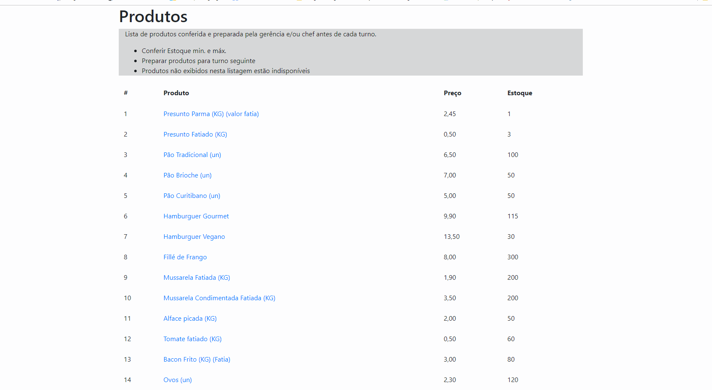
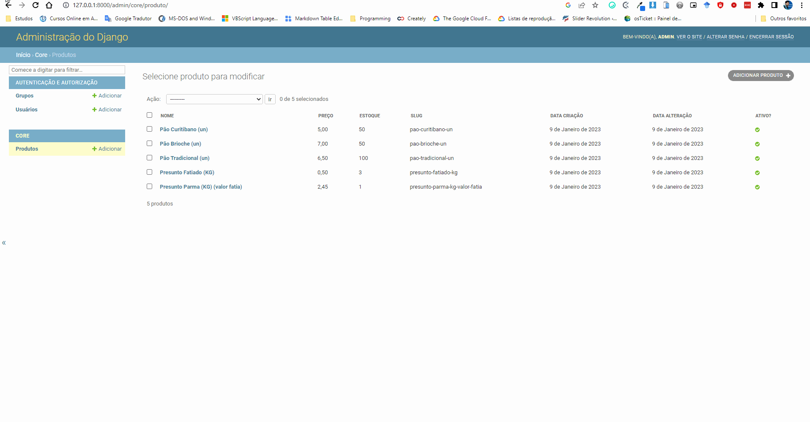
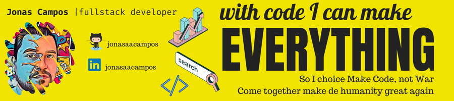

<p align="center">
   <a href='https://github.com/jonasaacampos'>
      
      </a>
      
      </a>
      
      </a>
</p>

<h1>Controle de itens adicionais lanchonete gourmet Django</h1>

> Painel administrativo de constrole de estoque e custo adicional para itens inseridos em lanches
> Sistema web usando Django MTV
> Banco de dados MySQL


Código fonte e aplicação gratuito para quaisquer finalidades. Peço que se possível:

- [ ] cite a fonte
- [ ] me conte o que achou

-------------

<p align="center">
<a href='https://github.com/jonasaacampos'></a>
<a href='https://www.linkedin.com/in/jonasaacampos'></a>
</p>


## Demo

### Frente de caixa

<p align="center">
   <a href='https://github.com/jonasaacampos'>
      
      </a>
</p>

### Painel de gestão

<p align="center">
   <a href='https://github.com/jonasaacampos'>
      
      </a>
</p>

<!-- 
<details>
<summary>

## Base de programação web
</summary>

</details> 
-->


### Configuração do ambiente

- [ ] Instalar dependências 
  - `pip install django whitenoise gunicorn django-bootstrap4 PyMySQL django-stdimage MySQL`
  - `pip freeze > requirements.txt`
- [ ] Iniciar projeto
  - `django-admin startproject gerencia_loja .`
- [ ] Iniciar a aplicação
  - `django-admin startapp core`

- [ ] Criar Banco de dados no MySQL Workbench
  - Criar nova conexão > em mySQL Connection, clique em "+". Dê o nome ao seu arquivo depois salve. Insira a senha do usuário solicitado para abrir a conexão.
  - escreva a query `CREATE DATABASE projeto_gerencia;`

### Iniciar Projeto

- [ ] `python .\manage.py migrate` para criar banco de dados
- [ ] `python manage.py createsuperuser`
- [ ] `python manage.py runserver`

**Toda vez** que alterarmos o arquivo models, realizar as migrações:

- `python .\manage.py makemigrations`
- `python .\manage.py migrate`

### Ferramentas úteis

Para listar todas as possibilidades dos Forms
```python
#python .\manage.py shell
from django import forms
dir(forms)

for method in dir(forms): 
	print(method)

## para ajuda    
help(forms.CharField)
```

Forms => não gravam no banco de dados
Model Forms -> Gravam no banco de dados


```html
<!--Página padrão par aimportação do bootstrap-->



<!DOCTYPE html>
<html lang="pt-br">
<head>
    <meta charset="UTF-8">
    <title>Home</title>
    
</head>
<body>



</body>
</html>
 
```

## Planejamento do projeto e requisitos

### Escopo
> o projeto terá 3 páginas
- [ ] index (para carregar dados)
- [ ] contato (para enviar email)
- [ ] formulario (para salvar dados)

**Regras de negócio**

- [ ] Definir rotas administrativas do projeto, inserindo um include e criar um arquivo de rotas na aplicação

## Referências e Ferramentas

- [MySQL Community Dowloads](https://dev.mysql.com/downloads/)
- [Git Ignore Generator](https://mrkandreev.name/snippets/gitignore-generator/#Python,Django,VirtualEnv,PyCharm+all,VisualStudioCode)


<!-- CONTACT -->

## Contato

**Author:** Jonas Araujo de Avila Campos



<p align='center'>
  <a href='https://github.com/jonasaacampos'>
    
  </a>
  <a href='https://www.linkedin.com/in/jonasaacampos/'>
    
  </a>
</p>
